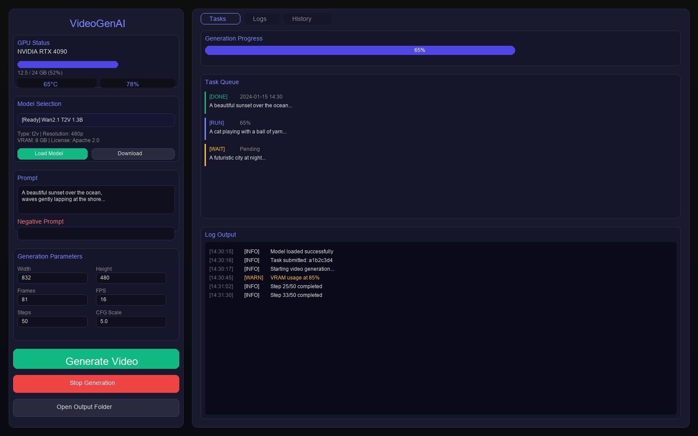
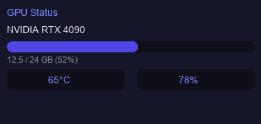

# VideoGenAI - 本地AI视频生成软件

<div align="center">


**100%本地运行 | 开源免费 | 支持商业使用**

</div>

## 🎯 项目简介

VideoGenAI 是一款完全本地运行的AI视频生成软件，基于最新的开源视频生成模型，无需联网即可使用。

## 📸 界面预览

<div align="center">

### 主界面预览


### GPU状态监控


</div>

> 💡 **提示**: 打开 [screenshots/ui_preview.html](screenshots/ui_preview.html) 查看完整的UI交互预览

### ✨ 核心特性

- **100%本地运行** - 所有推理在本地GPU完成，无需调用任何付费API
- **完全免费开源** - 基于Apache 2.0许可证，支持商业使用
- **一键启动** - 双击launcher.py即可运行，无需命令行操作
- **现代化界面** - 类似Stable Diffusion的桌面应用体验
- **插件化设计** - 支持扩展新模型、LoRA、ControlNet等

### 🤖 支持的模型

| 模型 | 类型 | 分辨率 | 显存需求 | 完整下载包 | 当前引擎状态 |
|------|------|--------|----------|------------|--------------|
| Wan2.1-T2V-1.3B | 文本转视频 | 480P | 8GB（低显存档位） | 约 27 GiB | 已接入 |
| Wan2.1-T2V-14B | 文本转视频 | 720P | 24GB | 约 75 GiB | 已接入 |
| Wan2.1-I2V-14B | 图片转视频 | 480P / 720P | 16–24GB | 约 84 GiB | 已接入 |
| CogVideoX-2B / 5B | 文本转视频 | 480P / 720P | 4–10GB | — | 注册但尚未接入引擎 |

> 下载包包含文本编码器、Transformer、VAE、Tokenizer 等完整 Diffusers 组件；不能仅按模型名称中的参数量估算磁盘空间。
### 🎬 功能列表

- ✅ Text To Video（文本转视频）
- ✅ Image To Video（图片转视频）
- ✅ 视频续写
- ✅ 视频扩展
- ✅ 控制视频长度
- ✅ FPS设置
- ✅ Seed控制
- ✅ CFG Scale
- ✅ Steps设置
- ✅ 分辨率选择
- ✅ Prompt输入
- ✅ Negative Prompt
- ✅ LoRA加载
- ✅ 模型切换
- ✅ 自动保存历史
- ✅ 自动保存Prompt
- ✅ 任务队列
- ✅ 中途停止
- ✅ GPU显存显示
- ✅ 生成进度
- ✅ 预计剩余时间
- ✅ 日志窗口
- ✅ 输出管理
- ✅ 批量生成

### ⚡ 推理优化

- ✅ FP16/BF16自动选择
- ✅ Flash Attention
- ✅ xFormers支持
- ✅ CPU Offload（低显存模式）
- ✅ Sequential Offload
- ✅ Attention Slicing
- ✅ VAE Tiling
- ✅ 显存自动管理
- ✅ Torch Compile（可选）

## Installation

### System requirements

- **Operating system:** Windows 10/11, 64-bit
- **Python:** 3.10 through 3.14, 64-bit
- **GPU:** NVIDIA GPU; the maintained installer uses official PyTorch CUDA 12.8 wheels
- **VRAM:** about 8 GB minimum for the 1.3B model; 24 GB or more is recommended for 14B models
- **System RAM:** 16 GB or more
- **Disk space:** at least 60 GiB free for the 1.3B package; 100 GiB or more for 14B/I2V packages

> Seeing a GPU in `nvidia-smi` does not prove that PyTorch can use CUDA. Run the environment verifier below.

### Recommended NVIDIA installation

From the project directory:

```powershell
python scripts/setup_environment.py --backend cuda --venv .venv
```

If an existing `.venv` contains CPU-only PyTorch, repair it with:

```powershell
python scripts/setup_environment.py --backend cuda --venv .venv --force-torch
```

You can also double-click `setup_cuda.bat`. The setup workflow:

1. creates or reuses `.venv`;
2. installs the pinned PyTorch stack from the official CUDA 12.8 wheel index;
3. installs the pinned application dependencies;
4. verifies Python, PyTorch CUDA, and NVIDIA device availability.

Start the application with:

```powershell
.\.venv\Scripts\python.exe launcher.py
```

or double-click `start.bat`.

### CPU/development environment

A CPU environment can run the UI, quality checks, and tests, but it cannot run Wan video inference:

```powershell
python scripts/setup_environment.py --backend cpu --venv .venv
```

### Verification commands

Code and dependency checks only:

```powershell
.\.venv\Scripts\python.exe scripts/verify_project.py --mode code
```

Python, PyTorch CUDA, and NVIDIA device checks:

```powershell
.\.venv\Scripts\python.exe scripts/verify_project.py --mode environment
```

Full runtime prerequisites, including a complete default model:

```powershell
.\.venv\Scripts\python.exe scripts/verify_project.py --mode runtime
```

Full quality gate:

```powershell
.\.venv\Scripts\python.exe scripts/quality_gate.py
```

### Dependency files

- `requirements-torch-cu128.txt`: pinned NVIDIA CUDA PyTorch stack;
- `requirements-torch-cpu.txt`: pinned CPU-only PyTorch stack;
- `requirements.txt`: pinned direct application dependencies, excluding PyTorch;
- `requirements-dev.txt`: pinned test, lint, type-check, and build tools.

Do not install `torch` from a generic package mirror and assume it has CUDA support. CUDA wheels must come from the official PyTorch index.

## 🚀 使用说明

### 首次启动

1. 双击 `start.bat`，或运行 `./.venv/Scripts/python.exe launcher.py` 启动程序。
2. 在模型区域选择 `wan2.1-t2v-1.3b`，点击“下载模型”；首次完整下载约为 **27 GiB**，中断后可续传。
3. 只有模型状态显示“完整 / Ready”后才能加载和生成。
### 基本使用

1. **选择模型**: 在左侧面板选择要使用的模型
2. **输入Prompt**: 在Prompt输入框描述你想生成的视频
3. **调整参数**: 根据需要调整分辨率、帧数、步数等参数
4. **点击生成**: 点击"生成视频"按钮开始生成
5. **等待完成**: 程序会显示进度，完成后自动保存到outputs目录

### 参数说明

| 参数 | 说明 | 默认值 |
|------|------|--------|
| 分辨率 | 视频的宽高 | 832x480 |
| 帧数 | 视频总帧数 | 81 |
| FPS | 每秒帧数 | 16 |
| Steps | 推理步数 | 50 |
| CFG Scale | 提示词引导强度 | 5.0 |
| Seed | 随机种子 | -1（随机） |

### 低显存模式

如果显存不足，可以：

1. 勾选"CPU Offload"选项
2. 使用1.3B模型
3. 降低分辨率到480P
4. 减少帧数

## 📁 项目结构

```
VideoGenAI/
├── models/              # 模型文件
├── loras/               # LoRA文件
├── outputs/             # 输出视频
│   └── history/         # 历史记录
├── configs/             # 配置文件
│   ├── config.json      # 用户配置
│   └── default_config.json
├── cache/               # 缓存文件
├── ui/                  # 界面代码
│   └── main_window.py   # 主窗口
├── backend/             # 后端代码
│   └── engine_manager.py
├── engines/             # 推理引擎
│   ├── base_engine.py   # 引擎基类
│   └── wan_engine.py    # Wan2.1引擎
├── utils/               # 工具代码
│   ├── config_manager.py
│   ├── logger.py
│   ├── gpu_monitor.py
│   ├── model_downloader.py
│   ├── task_queue.py
│   └── history_manager.py
├── plugins/             # 插件目录
├── scripts/             # 脚本工具
├── logs/                # 日志文件
├── main.py              # 主程序
├── launcher.py          # 启动器
├── requirements.txt     # 依赖列表
└── README.md            # 说明文档
```

## 🔧 配置说明

配置文件位于 `configs/config.json`：

```json
{
    "app": {
        "name": "VideoGenAI",
        "version": "1.0.0",
        "theme": "dark"
    },
    "models": {
        "default_model": "wan2.1-t2v-1.3b",
        "models_dir": "./models",
        "auto_download": true
    },
    "generation": {
        "default_resolution": "832x480",
        "default_fps": 16,
        "default_steps": 50
    },
    "optimization": {
        "cpu_offload": false,
        "vae_tiling": true
    }
}
```

## 📝 更新日志

### v1.0.0 (2025-07-16)
- 初始版本发布
- 支持Wan2.1模型
- 支持CogVideoX模型
- 完整的GUI界面
- 任务队列系统
- 历史记录管理

## 🤝 贡献

欢迎提交Issue和Pull Request！

## 📄 许可证

本项目采用 [Apache 2.0 许可证](LICENSE)。

## 🙏 致谢

- [Wan2.1](https://github.com/Wan-Video/Wan2.1) - 阿里巴巴通义万相视频生成模型
- [CogVideoX](https://github.com/THUDM/CogVideo) - 智谱AI视频生成模型
- [Diffusers](https://github.com/huggingface/diffusers) - Hugging Face扩散模型库
- [PySide6](https://wiki.qt.io/Qt_for_Python) - Qt for Python

## 📧 联系方式

如有问题，请提交Issue或联系开发者。

---

<div align="center">

**⭐ 如果这个项目对你有帮助，请给个Star！⭐**

</div>
